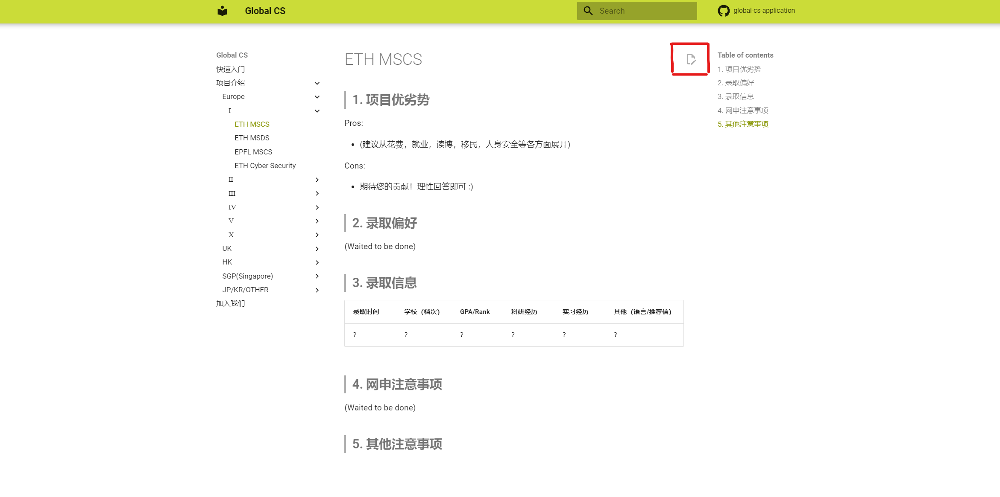
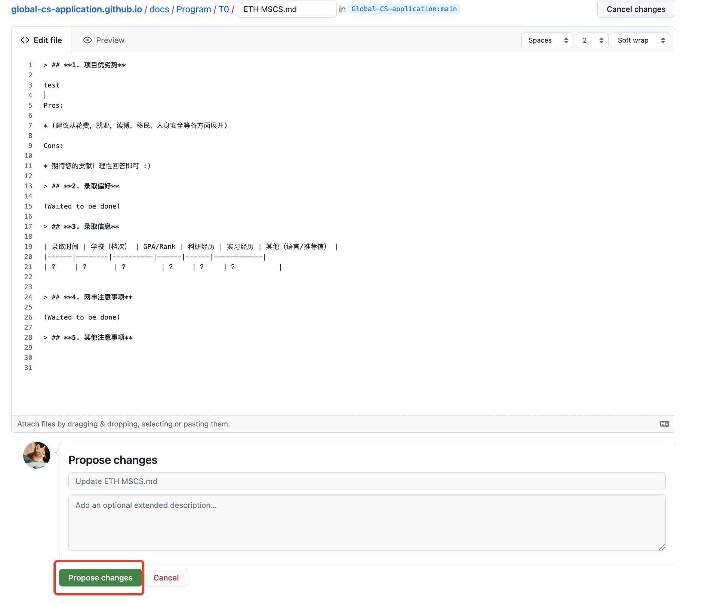
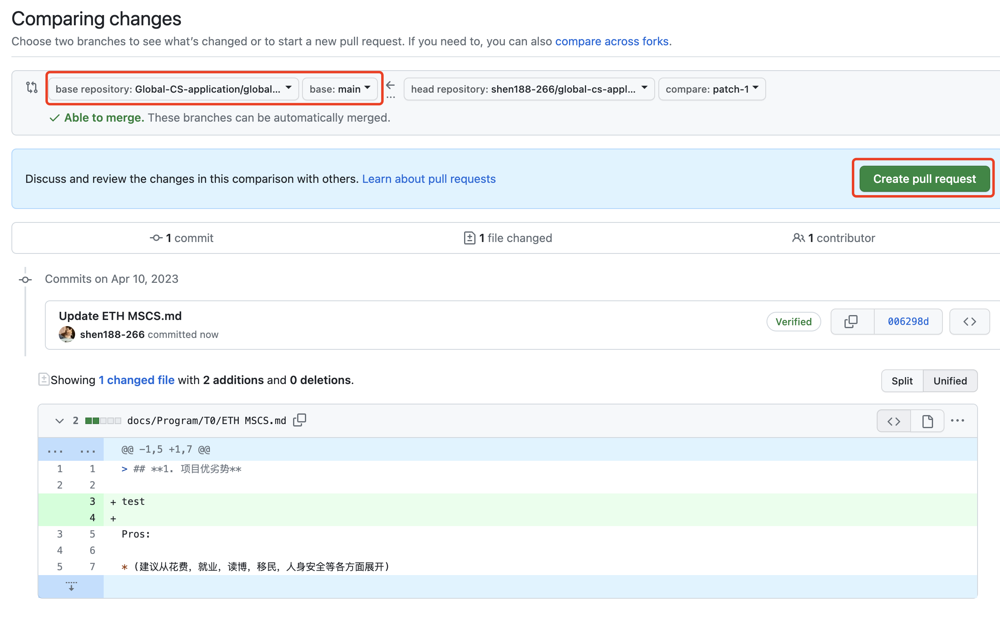

> ## **为什么加入Global-CS?**

本项目诚邀各位一起贡献内容，你可能会收获：

* 一个**持续增长star**的github项目, 建议赶快点个star马上入股（doge)
* 提交pr两次并都被merge之后，会达成github成就**Pull Shark**并显示在个人主页。这很酷，不是吗？
* 加入**Global-CS**（一个github组织），我们有一个很帅的图标，这会显示在你的个人主页中
* 助人为乐，手有余香的快乐 :)
* 认识一帮友善并乐于奉献的同学 :)

??? tip "项目QQ群"

    官方一群：340716708 （问题密码： Global CS)
***

> ## **贡献方式**

本项目目前暂时支持两种贡献方式, 贡献具体方式见下方（如果有其他好的想法，欢迎提出github issue交流）:

* 填补各个项目信息并提交pr（这非常重要！）
* 提交申请季总结/经验
* 添加新申请项目

??? success "(1) 填补各个项目信息"

    PR (Pull Request) 是基于 Git 的协同创作方式，允许用户方便地进行贡献内容，允许维护者进行审核。
    
    下面通过提交ETH MSCS项目修改，进行无代码 PR 的最佳实践。直接点击[ETH MSCS](Program/T0/ETH MSCS.md)页面编辑按钮，点击想要更改的页面右上角的编辑图标（铅笔形状）。
    
    
    
    初次提交点击`Fork this repository`将仓库 fork 到自己的账户下
    
    
    
    在窗口内使用 Markdown 语法直接进行更改，点击`Propose changes`完成更改
    
    
    
    点击`Create pull request`向`global-cs-application.github.io:main`分支发起 Pull Request
    
    
    
    等待 Pull Request 审核通过后，内容会被自动编译并部署到网页，不需要用户进行额外操作。再次提交更新重复步骤 1 即可，第二次提交可以省略步骤 2
    
    

??? success "(2) 提交申请季总结/经验"

    **1. 首先fork本项目至自己的github账户下（如果已经fork该项目则忽略该步骤）**

    

    成功的话你会在自己的个人仓库下有一个一模一样的项目

    

    **2.点入自己账号下面的仓库，clone至本地（注意千万不要clone我们的原始仓库！）**

    在本地仓库的docs/summary/23fall 下面添加一个markdown文件（用.md结尾即可）,这里我们用test.md为例。

    
    
    注意：你的所有申请总结就写在这个文件中（之后的工作主要是在网页中显示你这个markdown文件

    **3.打开项目中mkdocs.yml文件，这里管理着所有页面的显示结构。**

    YAML 是 YAML Ain't Markup Language 的递归缩略语，也是一种人类可读（human-readable) 的数据序列化语言，其文件扩展名为 .yml 或 .yaml（官方推荐）。常被用作和 JSON 格式文件一样编写配置或存储相关数据内容。

    找到图片中所指示的位置，添加一行（这里添加了两行，分别是`- Test Page1: "summary/23fall/test.md"` 和 `- Test Page1: "summary/23fall/test.md"`。
    注意再添加的一行需要与这两行保持缩进， `Test Page1`代表着你申请总结的标题，后面的路径指示你的md文件的路径。

    

    **4.git push 你的改动同步到个人仓库**

    这是一个基本的github技能，不再赘述。常用流程 

    * git pull
    * git add .
    * git commit -m "简单描述你添加了哪些内容“
    * git push 

    **5.回到个人仓库提交pr即可，记得在pr中写一下你做了哪些修改，之后的工作我们小伙伴会把你的内容merge进入原始仓库，你的修改就完成啦！**

    

    

??? success "(3) 添加新申请项目"

    可以参考如何贡献个人总结，唯一的区别在于创建markdown文件的位置在于`docs/Program/TX`下面。

    然后对于yml文件的修改, 把md文件添加到放到对应栏目位置即可。（我们已经添加了很多项目了，所以你可以依葫芦画瓢找位置加上就行）

    其他流程保持一致。